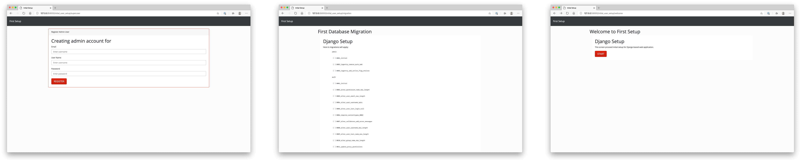

# Django Initial Setup




Django Initial Setup provides inital setup screen developed with Django for first launch.

## Install

To install **django-initial-setup**, run following command if you use `pipenv`. 

```
pipenv install django-initial-setup
```

After installing, add **first_setup** to `INSTALLED_APPS`.

```
INSTALLED_APPS = (
    ...
    'first_setup',
)
```

### Activate routing

After installed **django-initial-setup**, activate url path editing `urls.py` like following. The routing accessing initial setup screen, is `/initial_user_setup/welcome` by default if the path set like follwing.

```python
from django.contrib import admin
from django.urls import path, include

urlpatterns = [
  	...
    path('', include('first_setup.urls')),
]

```

